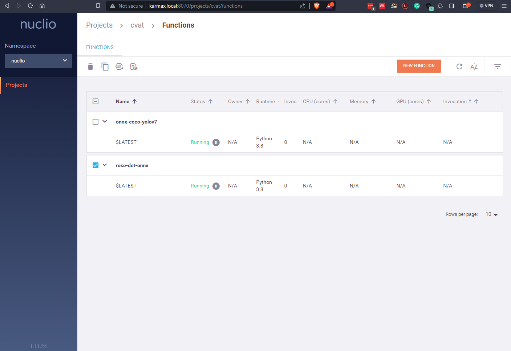
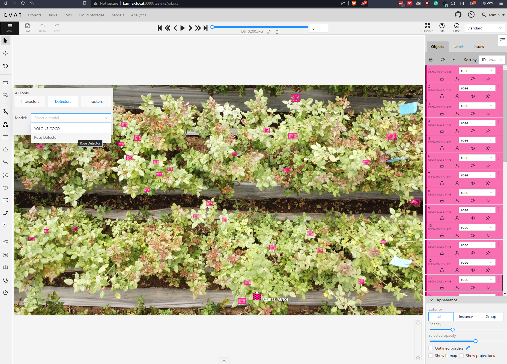

# CVAT Setup [v2.9.1](https://github.com/opencv/cvat/releases/tag/v2.9.1)

#### (a.) Installation Guide
- Setup
    - mkdir -p -- "../cvat_data"
    - Ensure CVAT `v2.9.1` version and paths in `*.bash` scripts
- Configure: `bash configure_cvat.bash`
    - configures and copies the docker-compose.local.yml file to ../cvat/ 
- Startup `bash startup_cvat.bash`
- Create User `docker exec -it cvat_server bash -ic 'python3 ~/manage.py createsuperuser'` 
    - User: `admin` & Pass: `nimda`
- CVAT UI http://karmax.local:8080/tasks
- Shutdown `bash shutdown_cvat.bash`
- Setup Nuclio [Serverless Functions](https://opencv.github.io/cvat/docs/manual/advanced/serverless-tutorial/)
    - Download & setup v1.11.24
    ```
    wget https://github.com/nuclio/nuclio/releases/download/1.11.24/nuctl-1.11.24-linux-amd64
    sudo chmod +x nuctl-1.11.24-linux-amd64
    sudo ln -sf $(pwd)/nuctl-1.11.24-linux-amd64 /usr/local/bin/nuctl
    ```
    - Nuclio Dashboard: http://karmax.local:8070/projects

#### (b.) CVAT CLI Tool
- Install `pip install cvat-cli==2.9.1`
- Documentation: https://opencv.github.io/cvat/docs/api_sdk/cli/
- Env: `export CVAT_HOST_AUTH="--server-host http://karmax.local:8080 --auth admin:nimda"`
- Operations on Task
    - Create new task
        ```
        cvat-cli $CVAT_HOST_AUTH create "sample-task" --labels '[{"name": "person"},{"name": "car"}]' \
        --chunk_size 8 --sorting-method random --frame_step 10 --copy_data --use_zip_chunks  \
        local ./sample/VIRAT_S_010204_05_000856_000890.mp4
        ```
    - List all task: `cvat-cli $CVAT_HOST_AUTH ls`
    - Delete  task: `cvat-cli $CVAT_HOST_AUTH delete <task_id>`
- [TODO] Annotations Import/Export
    - Import task backup: `cvat-cli $CVAT_HOST_AUTH import file_name.zip`
    - Export task backup: `cvat-cli $CVAT_HOST_AUTH export task_id file.zip`
    - Dump task annotation: `cvat-cli $CVAT_HOST_AUTH dump --format "CVAT for video 1.1" task_id output.zip`
    - Upload task annotation: `cvat-cli $CVAT_HOST_AUTH upload --format "CVAT for video 1.1" task_id annotation.xml`
- [TODO] Auto Annotate: https://opencv.github.io/cvat/docs/api_sdk/cli/#auto-annotate

#### (c.) Serverless Functions Guide
```
git clone https://github.com/WongKinYiu/yolov7
conda install pytorch torchvision torchaudio pytorch-cuda=11.8 -c pytorch -c nvidia
conda install onnx onnxruntime seaborn tensorboard pandas
wget https://github.com/WongKinYiu/yolov7/releases/download/v0.1/yolov7.pt
python export.py --weights yolov7.pt  --grid --end2end --simplify --topk-all 100 --iou-thres 0.65 --conf-thres 0.35 --img-size 640 640 --max-wh 640
```
- [Tested] Custom YoloV7 model to ONNX format for CVAT/Nuclio deployment
    - Copy the ONNX weights to nuclio folder
        ```
         cp yolov7.onnx ~/dev/labelercv/cvat_scripts/nuclio/yolov7-coco/
        ```
    - Deploy Function Reference: https://github.com/opencv/cvat/pull/5552
        ```
        nuctl deploy onnx-coco-yolov7 --project-name cvat --path ./nuclio/yolov7-coco --volume `pwd`/nuclio/yolov7-coco/yolov7.onnx:/opt/nuclio/best.onnx --platform local
        ```
- [`Rose Detection`] Custom detector model to ONNX format for CVAT/Nuclio deployment
    ```
    nuctl deploy rose-det-onnx --project-name cvat --path ./nuclio/rose-det-onnx --volume `pwd`/nuclio/rose-det-onnx/rose_yolov5l_512.onnx:/opt/nuclio/best.onnx --platform local
    ```
    
- Test and debug in the nuclio docker 
    ```
    docker exec -it nuclio-nuclio-rose-det-onnx  bash
    python test_onnx.py
    ```
    - CURL test on http://karmax.local:8070/projects/cvat/functions/rose-det-onnx/code
    ```
    (echo -n '{"image": "'; base64 ./nuclio/rose-det-onnx/DJI_0002.JPG; echo '"}') | curl -H "Content-Type: application/json" -d @-  http://0.0.0.0:52479 
    ```
- Verify `nuctl get functions`
    ```
    (yolo) rahul@karmax:~/dev/labelercv/cvat_scripts$ nuctl get functions
    NAMESPACE | NAME          | PROJECT | STATE | REPLICAS | NODE PORT
    nuclio    | rose-det-onnx | cvat    | ready | 1/1      | 55135
    ```
    - Remove function: `nuctl delete function rose-det-onnx`

- Auto Annotation


#### (d.) Upgrade Guide
- Upgrade CVAT deployed with docker compose 
    - https://opencv.github.io/cvat/docs/administration/advanced/upgrade_guide/

#### (e.) Destroy the environment and cleanup
- Delete docker cvat environment including the volumes
    ```
    docker compose -f docker-compose.local.yml -f components/serverless/docker-compose.serverless.yml  down --rmi all --volumes --remove-orphans
    rm -rf ~/dev/cvat_data/*
    ```